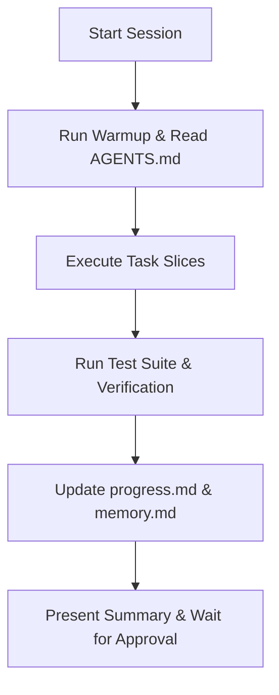

# heartbeat.md — Session Health & Liveness Protocol

This document defines periodic check-ins, health checks, background task monitors, and session sync protocols.

---

## 💓 Session Health Checks

### 1. Pre-Task Warmup
- Execute session warm-up procedure (via `.agents/skills/warmup/SKILL.md`).
- Verify active workspace rules (`AGENTS.md`) and memory context (`memory.md`).

### 2. Execution Audits
- Verify background task status using `manage_task` (Action: `status`).
- Audit local changes via `git status` prior to summarizing work.

### 3. Safety Checkpoint
- Confirm no unapproved `git commit` or `git push` commands have been executed.
- Ensure all updated or created code files have corresponding unit tests passing cleanly.

---

## 🔄 Periodic Heartbeat Cadence

